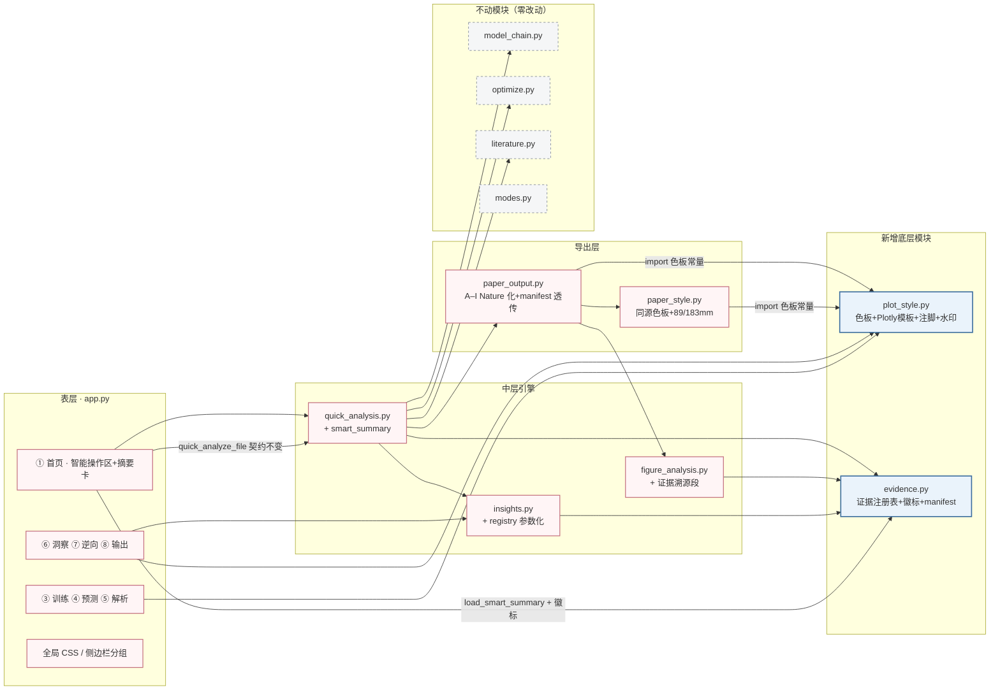
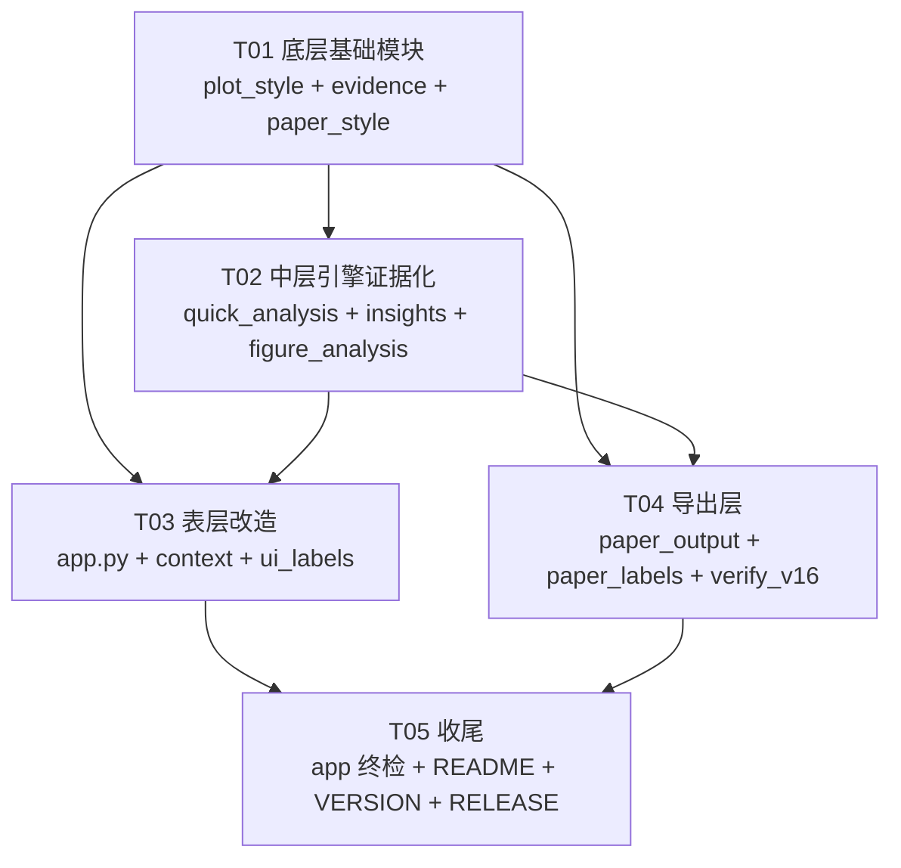

# 双阳极等离子喷涂智能工艺设计平台 V1.6 增量架构设计 + 任务分解

- **文档类型**：增量系统设计（V1.5 → V1.6），配合《PRD_V1.6_incremental.md》阅读
- **基线版本**：V1.5（app.py 1640 行 + src/ 18 模块 + 8 Tab）
- **架构师**：高见远（Bob）｜ **状态**：待工程师执行
- **已拍板决策（作为硬约束写入）**：智能摘要卡 V1.6 仅覆盖 Quick Run；论文图 Nature 正刊版式（单栏 89mm / 双栏 183mm）；P2 全砍、P0 全做 + P1 全做；V1.5 旧 run 无 manifest 显示「旧版运行，无溯源数据」；UI 全中文、论文图可切英文

---

## 一、实现方案总览

### 1.1 技术难点与对策

| 难点 | 对策 |
|------|------|
| 全站 8 Tab 图表样式统一且不引入回归 | 新建 `src/plot_style.py` 作为**色板与 Plotly 模板唯一来源**，所有图走统一入口函数（parity / importance / 布局 / 注脚 / 水印），不逐图手调 |
| 网页（Plotly）与论文图（matplotlib）观感一致 | 色板常量只定义一份（plot_style.py），`paper_style.py` import 同源常量；杜绝双处维护 |
| 「反模板红线」——结论句必须从真实计算值拼接 | 新建 `src/evidence.py`：`EvidenceRegistry.statement()` 强制 `template.format(**values)`，`required` 度量任一缺失/NaN 即返回降级句「当前数据不足以支持该判断」，不可能产出套话 |
| 证据溯源要在文本生成处落地，不是事后包装 | registry 在 `quick_analysis.run_quick_analysis()` 开头创建，沿调用链传入 `insights.build_insight_report()` / `figure_analysis.analyze_figure()`，生成即注册，run 结束落盘 `evidence_manifest.json` |
| 原地升级不减功能（P0-6 13 项） | 明确「不动清单」模块（model_chain / optimize / literature / modes / research_utils / data_utils / features / config），diff 必须为零；app.py 只重组信息层级不改功能归属 |
| Streamlit 无法编程切换 Tab（P0-3 要求跳转链接） | 降级方案：摘要卡行动区给「下一步指引 + run_id 一键复制」，侧边栏同步提示（详见 §8 待明确事项） |

### 1.2 模块级变更地图

| 类别 | 文件 | 变更内容 |
|------|------|---------|
| **新增** | `src/plot_style.py`（~260 行） | 三家族色板常量、Plotly Nature 模板、统一图入口、统计诚信注脚、Demo 水印、下载行组件 |
| **新增** | `src/evidence.py`（~220 行） | EvidenceItem / EvidenceRegistry、statement 取值即拼接 + 缺证降级、manifest 读写、证据徽标 UI、旧 run 兼容提示 |
| **新增** | `scripts/verify_v16.py`（~120 行） | 色值残留扫描（禁 plotly/seaborn 默认色）、禁用词检查、evidence 抽查脚本（QA 辅助） |
| **修改** | `src/paper_style.py`（+~60 行） | 色板改为 import plot_style 同源常量；新增 89/183mm 版式 helper、统一注脚框、水印换色 |
| **修改** | `src/paper_output.py`（~30 处色值 + ~80 行） | 全部 hex 字面量替换为 plot_style 常量；figsize 归一到 89/183mm 系；Fig_H01–03 seaborn 残留色换 NATURE 循环；build_bundle ZIP 打包 evidence_manifest.json |
| **修改** | `src/quick_analysis.py`（+~150 行） | registry 接线（不改隔离逻辑）；新增 build_smart_summary / load_smart_summary；record 增 manifest/summary 字段 |
| **修改** | `src/insights.py`（+~90 行） | build_insight_report 增可选 registry 参数，各 section 结论改为 statement 生成；报告追加证据溯源附录 |
| **修改** | `src/figure_analysis.py`（+~40 行） | analyze_figure 增 eid/registry 可选参数，附「证据溯源」段（向后兼容） |
| **修改** | `src/context.py`（+~25 行） | 增供状态徽标（P0-7/P1-2）同源读取的辅助字段/函数 |
| **修改** | `src/ui_labels.py`（+~30 行） | 新增各 Tab 导语文案、智能操作区文案、证据徽标标签 |
| **修改** | `app.py`（重构 ~500 行） | tab0 首页重构为智能操作区 + 摘要卡；全 Tab 四段式 + status-pill + plot_style/evidence 接入；全局 CSS 增强；侧边栏分组 |
| **修改** | `src/paper_labels.py`（+~15 行） | 补充注脚/版式相关英文标签 |
| **修改** | `requirements.txt`、`README_先看我.md`、`VERSION`、`docs/RELEASE_V1.6.md` | 收尾（T05） |
| **不动** | `src/model_chain.py`、`src/optimize.py`、`src/literature.py`、`src/modes.py`、`src/research_utils.py`、`src/data_utils.py`、`src/features.py`、`src/config.py` | OOF/CV 训练逻辑、优化搜索、文献 Schema、模式隔离一律零改动 |

### 1.3 组件图（Mermaid）



（说明：`context.py`、`ui_labels.py`、`paper_labels.py` 小幅修改，图中归入表层/导出层修改类。）

---

## 二、新增模块详细设计

### 2.1 `src/plot_style.py`（新增，~260 行）

**定位**：全平台网页图表（Plotly）样式唯一来源；同时是 matplotlib 侧（paper_style.py）的色板常量唯一来源。模块顶层**不 import streamlit**（仅函数内惰性 import），保证被 paper_style 安全引用。

#### 2.1.1 三家族色板（唯一定义处，禁止散落字面量）

```python
# ============ 中性灰家族（文字/网格/参考线） ============
GRAY_INK    = "#2F3440"   # 正文主文字
GRAY_MUTED  = "#7A8290"   # 辅助文字 / 轴标签 / caption
GRAY_BORDER = "#E5E9EF"   # 边框 / 分隔线 / 卡片描边
GRAY_PAPER  = "#FAFBFC"   # 页面底色
GRAY_REF    = "#98A2B3"   # 参考线 / 1:1 虚线 / 网格（低饱和蓝灰，继承 V1.5 #98a2b3）

# ============ 信号蓝家族（主方法 / 数据系列 / 主色） ============
BLUE_SIGNAL = "#3C6E9F"   # 图表主系列（V1.5 #3D5A78 加深一档，低饱和）
BLUE_MID    = "#6B93BF"   # 第二系列 / 次级数据
BLUE_LIGHT  = "#A9C9E5"   # 淡填充 / 趋势带（继承 V1.5）
BLUE_FAINT  = "#EAF3FB"   # 按钮底 / 选中态（继承 V1.5）

# ============ 强调粉家族（智能按键实底 / 强调标注，≤2 处/页） ============
PINK_ACCENT = "#C4707F"   # 智能按键实底 / 强调（V1.5 #E8B8C0 加深至可读实底）
PINK_MID    = "#DB9AA6"   # 次级强调 / 徽标边
PINK_LIGHT  = "#E8B8C0"   # obj-card / 淡强调（继承 V1.5）

# ============ 方向色（仅涨跌/优劣语义，禁止装饰） ============
SEM_GOOD = "#6FA57C"      # 低饱和绿（优 / 达标）
SEM_BAD  = "#C47070"      # 低饱和红（劣 / 超限）

# ============ 分类循环色（≤6 类，兼容色弱，禁 plotly/seaborn 默认） ============
QUAL_CYCLE = ["#3C6E9F", "#8A93A3", "#C4707F", "#6B93BF", "#A98F96", "#4C5A6E"]

WEB_FONT = 'Times New Roman, "Songti SC", SimSun, STSong, "Noto Serif CJK SC", serif'
```

设计依据：中性灰维持 V1.5 基调；信号蓝按 PRD「≈#3C6E9F 量级」定稿；强调粉按「≈#C4707F 量级」定稿；方向色低饱和。旧 V1.5 值（#A9C9E5/#E8B8C0/#EAF3FB）保留为家族浅档，观感连续不突变。

#### 2.1.2 函数签名

```python
def blue_ramp(n: int) -> list[str]
    """顺序/连续系列：BLUE_SIGNAL → 蓝灰等距插值 n 档（用于熔融类别、Stage 分级等）"""

def register_nature_template() -> None
    """注册并设为默认 Plotly template "nature"（白底、WEB_FONT、GRapY_REF 网格、
    无鲜艳循环色）。app.py 36–42 行的手工 template 设置改由本函数替代。"""

def nature_layout(fig, *, title=None, height=None, width=None,
                  margin=None, legend="top", showlegend=None) -> plotly.graph_objects.Figure
    """统一布局：白底、标题字号 15–19、边距规范（l=10,r=30,t=45,b=10 家族）、
    legend 横向置顶无框；返回同 fig（链式）。"""

def apply_series_colors(fig, series_names=None, family="qual") -> Figure
    """按语义分配 color_discrete_map：qual=QUAL_CYCLE 循环；blue=blue_ramp(len)。"""

def parity_chart(df, *, x, y, x_label, y_label, title=None, identity=True) -> Figure
    """网页 parity 统一入口：散点 BLUE_SIGNAL、1:1 虚线 GRAY_REF、轴等比例。
    （app.py tab4 L1026–1033、tab7 内联 parity 全部改走此函数）"""

def importance_chart(imp_df, *, title, x_label="特征重要性") -> Figure
    """横向条形图统一入口：BLUE_SIGNAL 单色、bar 文本直接标注（替代图例）。"""

def stat_note(*, n=None, r2=None, rmse=None, mae=None, mae_f1=None,
              cv_method=None, errbar=None, extra=None) -> str
    """统计诚信注脚文本：拼出 'n=45 ｜ R²=0.874 ｜ RMSE=0.213 ｜ CV: GroupKFold(5)'
    式注脚；全部缺失时返回空串。数值一律由调用方传入，本函数不计算。"""

def add_stat_note(fig, note: str, *, position="bottom") -> Figure
    """把 stat_note 文本以 caption 注脚加到图内（P0-4 验收 2 的强制项）。"""

def add_demo_watermark(fig) -> Figure
    """Demo 水印：右上角文本标注「演示数据 DEMO」，PINK_ACCENT 半透明，不遮挡数据。
    真实数据模式一律不调用（P1-5）。"""

def fig_download_row(fig, data_df, stem: str, *, key: str) -> None
    """P1-4 统一下载入口：图下方渲染『下载原图 PNG ｜ 源数据 CSV』两个
    st.download_button（PNG 用 fig.to_image(format="png", scale=2)，需 kaleido；
    内部惰性 import streamlit）。失败时降级为仅 CSV 并 caption 说明。"""
```

#### 2.1.3 hero panel 布局约定（P0-4 验收 4）

- 每个 Tab 的主图调用 `nature_layout(fig, height=主面板高≥420)`，直接 `st.plotly_chart(fig, width="stretch")`；
- 次级图一律包 `with st.expander("次级证据：…", expanded=False)`；
- 约定常量 `HERO_HEIGHT = 460`、`SUB_HEIGHT = 340` 由 plot_style 导出，全站统一。

### 2.2 `src/evidence.py`（新增，~220 行）

**定位**：全程可溯源机制（P0-2）的核心。文本生成处落地：registry 随 quick_analysis / insights / figure_analysis 的生成流程创建与传递，非事后包装。

#### 2.2.1 数据结构

```python
SOURCE_CLASS_LABEL = {
    "direct": "[直接数据]",   # n/mean/std/CV%/min–max，来自事实行（insights._fact_df）
    "model":  "[模型推断]",   # R²/RMSE/MAE/CV 方式与折数/OOF/SHAP/FI
    "meta":   "[数据来源]",   # run_id/数据版本 hash/模型版本/Demo 标记
}
DEGRADE_TEXT = "当前数据不足以支持该判断"

@dataclass
class EvidenceItem:
    eid: str                    # 证据 ID，run 内唯一，命名规则见 §7.2
    text: str                   # 结论句（已格式化；降级句时 text=DEGRADE_TEXT）
    source_class: str           # "direct" | "model" | "meta"
    values: dict                # 引用的全部数值（float/str/int），QA 抽查对照字段
    computed_by: str            # 计算入口，如 "insights.coverage_stats"
    data_version: str | None    # "auto_xxxx"
    model_version: str | None
    rows_filter: str            # 如 "data_origin ∈ {experimental, literature, cfd}"
    files: list[str]            # 来源文件相对路径
    demo: bool
    degraded: bool              # 是否缺证降级
    created_at: str             # ISO 8601
```

#### 2.2.2 EvidenceRegistry

```python
class EvidenceRegistry:
    def __init__(self, run_id: str, run_dir=None, *, demo=False,
                 data_version=None, model_version=None): ...

    def statement(self, eid: str, template: str, *, source_class: str,
                  computed_by: str, values: dict, required=(),
                  rows_filter="", files=None) -> str:
        """核心：取值即拼接 + 缺证降级。
        - 尝试 template.format(**values)；required 中任一键缺失 / NaN →
          返回 DEGRADE_TEXT（并注册 degraded=True 的 item，values 记录缺失键）
        - source_class="model" 且 "cv_method" 不在 values → 自动追加
          『在当前模型中』限定词缺失告警（降级为不输出该判断）
        - demo=True → 返回文本前缀「[演示数据] 」
        - 成功则注册 EvidenceItem 并返回格式化句子"""

    def register(self, item: EvidenceItem) -> None: ...
    def get(self, eid: str) -> EvidenceItem | None: ...
    def items(self) -> list[EvidenceItem]: ...

    def save(self, run_dir=None) -> Path:
        """写 evidence_manifest.json：{eid: {values, computed_by, data_version,
        model_version, rows_filter, files, text, source_class, demo, degraded, created_at}}"""

    @classmethod
    def load(cls, run_dir) -> "EvidenceRegistry | None":
        """读 manifest；不存在/损坏 → None（调用方走旧 run 兼容提示）"""
```

#### 2.2.3 UI 组件（Streamlit 侧，惰性 import）

```python
def badge_html(item: EvidenceItem, run_id: str | None = None) -> str
    """证据徽标 HTML：[n=45 ｜ R²=0.874 ｜ Run_QA_xxx]，按 source_class 着色
    （direct=BLUE_FAINT 底/BLUE_SIGNAL 字；model=白底/GRAY_INK 字；
      meta=GRAY_PAPER 底/GRAY_MUTED 字；demo 一律 PINK_LIGHT 底/PINK_ACCENT 字）。"""

def badge_row(sentence: str, item: EvidenceItem, *, key: str = None) -> None
    """渲染『结论句 + 徽标』，徽标下挂 st.popover/expander『证据详情』：
    数值表(values) + 计算方式(computed_by) + rows_filter + 来源文件列表。"""

def legacy_run_notice() -> None
    """V1.5 旧 run（无 manifest）：st.caption('旧版运行，无溯源数据')——已拍板的兼容方案。"""

def demo_banner() -> None
    """Demo 顶部醒目条（配合 P1-5 全站水印）。"""
```

manifest 落盘位置：`runs/quick_analysis/<run_id>/evidence_manifest.json`；随 `PaperExporter.build_bundle()` 复制进结果 ZIP（P0-2 验收 6）。

---

## 三、首页智能操作区设计（app.py tab0 重构）

### 3.1 代码结构（替换 app.py L305–408）

```python
with tab0:
    # ---------- ① 智能操作区（Smart Actions Hub，P0-1）首屏第一视觉 ----------
    with st.container():
        st.markdown('<div class="smart-hub-title">智能操作区 Smart Actions</div>',
                    unsafe_allow_html=True)
        c_imp, c_ana = st.columns(2)          # 两按钮各占 ~1/2，总宽 ≥ 2/3 页宽
        with c_imp:
            # 「⬆ 智能一键导入」：st.button(kind 语义) + CSS .smart-btn 强制
            # height≥56px、PINK_ACCENT 实底白字 18px（全站唯一实底强调按钮）
            # 点击 → 展开内联拖放区（保留 key="qa_uploader"，行为与 V1.5 完全一致）
            ...
        with c_ana:
            # 「✦ 智能分析」三态：
            #   空态：无文件无 run → 按钮半透明(.smart-btn-ghost)，点击 info 引导导入
            #   就绪态：有文件未分析 → 触发 qa.quick_analyze_file(...)
            #   结果态：有最新 run → qa.load_smart_summary(run_id) 刷新摘要卡，
            #           并给「下载结果包 ZIP」「查看运行目录」次级按钮
            ...
        render_step_indicator()               # ① 导入 → ② 分析 → ③ 结论（P1-3）

    # ---------- ② 智能分析摘要卡（Smart Summary Card，P0-3） ----------
    if st.session_state.get("smart_summary_run_id"):
        render_smart_summary(st.session_state["smart_summary_run_id"])

    # ---------- ③ 研究主线卡片 flow-card（V1.5 原样保留） ----------
    ...

    # ---------- ④ 运行历史 / 设为正式模型（折叠 expander，V1.5 原样保留） ----------
    ...

    # ---------- ⑤ 平台状态面板（P1-2 升级） ----------
    ...
```

### 3.2 三步指示器（P1-3）

- 状态存 `st.session_state["smart_step"]`：`{"step": 1|2|3, "state": "idle|running|done|fail", "msg": str}`；
- 渲染：横向三节点 CSS stepper（`.step-node` / `.step-node.active` / `.step-node.done` / `.step-node.fail`），配合运行中的 `st.status` 实时写 `_cb` 回调（复用 V1.5 `_cb` 契约：`(name, status, msg)`）；
- 任一步失败：指示器停在该步并显示失败原因（来自 `data_readiness_issues` 的 critical 或异常 `friendly_error`），不产出半成品结论（P0-3 验收 4）；
- 成功：指示完成 + 「查看摘要卡」「下载结果包」两个动作按钮。

### 3.3 摘要卡 render_smart_summary(run_id)（P0-3）

数据来源：`qa.load_smart_summary(run_id)` → 读 `runs/quick_analysis/<run_id>/summary.json` + `evidence_manifest.json`。四区结构：

1. **顶部**：Run ID / 研究模式 / 数据版本 / 样本量 / 日期 + status-pill 一行（数据来自 summary.json header，真实计算值）；
2. **证据区**：Stage 1 / 1.5（如启用）/ 2 / 3 各目标 R²/RMSE/n 小表格 + Top 5 特征重要性横向条形图（复用 `plot_style.importance_chart`）；
3. **结论区**：3–6 条结论句，每句 `evidence.badge_row(sentence, item)`——徽标可点开溯源；run 无 manifest → `evidence.legacy_run_notice()`；
4. **行动区**：跳转 ③⑤⑥⑦⑧ 的「下一步指引」（Streamlit 无法编程切 Tab，降级为指引文案 + run_id 一键复制，见 §8）+ 下载结果包 ZIP（`st.download_button` 读 run 目录 zip）。

分析失败/数据不足：如实展示失败原因 + 已通过/未通过的检查项（沿用 `data_readiness_issues` 输出），禁止显示半成品结论。

### 3.4 与 quick_analysis.py 的调用契约

| 契约项 | 约定 |
|--------|------|
| 入口 | `qa.quick_analyze_file(file, progress_cb=_cb, demo=use_demo)` **签名与行为不变**；多 Sheet 逐表独立 Run、不合并文献 Sheet（P0-1 验收 2） |
| 隔离 | Quick Run 仍只写 `runs/quick_analysis/<run_id>/`，不覆盖 `models/`；promote 仍须用户主动确认（`promote_to_formal` 零改动） |
| 新增 | `qa.build_smart_summary(bundle, schema, extras, *, demo, run_id) -> dict`（run_quick_analysis 内部在成功路径调用并落 `summary.json`）；`qa.load_smart_summary(run_id) -> dict \| None` |
| record | history record 新增 `"evidence_manifest": str|None, "summary": str|None` 字段（增量字段，旧字段不动，向后兼容） |
| 字段歧义 | 高置信度别名自动映射（GENERIC_ALIAS 不变），仅歧义字段弹确认 |

---

## 四、各 Tab 改造点清单（app.py，⚠️ 注意 tab 变量名错位：tab5=⑥洞察、tab6=⑦逆向、tab7=⑧输出）

| 区域 | 行号区间 | 改造点 |
|------|---------|--------|
| **全局 CSS** | L76–150 | 新增：`.smart-hub-title`、`.smart-btn`（≥56px 高、PINK_ACCENT 实底、白字 18px、占宽≥2/3）、`.smart-btn-ghost`（空态半透明）、`.step-node` 三态、`.ev-badge` 三源配色、`.demo-banner`、`.sum-card`（1px 边框 + 3px 顶部 PINK_ACCENT 色带，flow-card 语言推广）；间距统一 8/12/16/24/32/48（P0-7 验收 3）；版本号 V1.5→V1.6（L153） |
| **Plotly 模板初始化** | L36–42 | 删除手工 template 设置，改 `plot_style.register_nature_template()` |
| **侧边栏** | L47–63、L250–277 | P0-7 验收 4：按「模式选择 → 数据来源 →（分隔）推荐流程 →（分隔）状态摘要」分组视觉强化（st.divider + 分组小标题），选项顺序不变；Demo 警告改 `evidence.demo_banner()` 风格 |
| **① 首页 tab0** | L305–408 | 全量重构（见 §三）：智能操作区 → 摘要卡 → 研究主线（保留）→ 运行历史/promote（保留）→ 状态面板升级（P1-2：5 metric 升级为与 ③⑧ 同源 context 数据：n / 批次 / 完整率 / 数据版本 auto_xxxx / 模型版本 / CV 方式 / 模式） |
| **② 数据管理 tab1** | L410–563 | 顶部加一句话导语 + status-pill（数据状态·n·数据版本）；「数据预览/完整度/重复性统计」收进 expander 次级证据区；异常字段为 hero（首屏可见）；文献模式变量选择保持操作区归属 |
| **③ 模型训练 tab2** | L565–731 | 导语 + status-pill（模型状态·CV 方式·n）；L678–693 的 `fig_r2` 色值 `#2f5f9e/#3a8f6f/#b0722d` → `plot_style.apply_series_colors`（QUAL_CYCLE 按 Stage 语义）；R² 总览图加 `stat_note`（CV 方式注脚）；CV 指标表旁挂证据徽标（model 类：R²/RMSE/n/CV，computed_by="model_chain.train_chain_full"）；弱目标警告文案纳入 P1-1 语体 |
| **④ 工艺预测 tab3** | L733–893 | 导语 + status-pill（模型版本·数据版本）；参数输入区为操作区（保留首屏）；三级结果表为 hero；「训练数据覆盖范围检查 + 历史数据参考」收 expander；Stage 1.5 结果表保留原逻辑 |
| **⑤ 模型解析 tab4** | L895–1109 | 导语 + status-pill；L932–940 特征重要性图 → `plot_style.importance_chart` + `fig_download_row`（P1-4）+ `stat_note`；L986–1096 熔融五组图：`apply_series_colors`（blue_ramp/QUAL_CYCLE）、parity 走 `parity_chart`、每图 `add_demo_watermark`（demo 时）、次级图收 expander；图组循环内为 hero/次级分层 |
| **⑥ 数据洞察 tab5** | L1111–1200 | 导语（三源分级说明保留）+ status-pill；coverage_text / 相关趋势 / 模型规律 / 复核 / 建议五个 container 各挂证据徽标（direct/model 类，computed_by 分别为 insights.coverage_stats / correlation_report / model_key_factors / anomaly_review / data_gap_suggestions）；L1144「生成科研解读」按钮调 `analyze_figure` 时传 eid/registry（界面态可传 None，仅 run 态传 registry）；data_origin 分布 caption 保留 |
| **⑦ 逆向设计 tab6** | L1202–1358 | 导语 + status-pill（模型版本·搜索域）；obj-card 保留（PINK_LIGHT 家族不动）；Pareto 结果表 + 范围表为 hero；Pareto 证据支持表收 expander 次级；推荐依据逐方案文案维持 insight_mod.recommendation_basis |
| **⑧ 结果输出 tab7** | L1360–1640 | 导语 + status-pill 与首页/③ 同源（P1-2 验收：n/数据版本/模型版本/CV 完全一致，同一 `CTX`）；A–I expander 结构本身已符合四段式，仅顶部 metric 区与 status-pill 合并去重；`_make_bundle` 成功后提供「下载 ZIP（含 evidence_manifest.json）」；置顶完整结果包入口保留 |
| **状态栏（全局）** | L279–298 | `context_status_items` 渲染保留；CT 构造不变（context.py 仅增只读辅助字段） |

每个 Tab 顶部一句话导语 + status-pill（P0-7 验收 1）统一由新 helper `render_tab_header(tab_key, ctx)` 实现（放 app.py 通用辅助区），文案表放 `ui_labels.py`。

---

## 五、paper_style.py / paper_output.py 升级点（P0-5）

### 5.1 `src/paper_style.py`（+~60 行）

1. **色板同源**：`from .plot_style import (GRAY_INK, GRAY_MUTED, GRAY_REF, BLUE_SIGNAL, BLUE_MID, BLUE_LIGHT, PINK_ACCENT, PINK_MID, SEM_GOOD, SEM_BAD, QUAL_CYCLE, blue_ramp)`——本文件不再出现任何 hex 字面量；
2. **Nature 版式常量与 helper**：
   ```python
   MM = 1 / 25.4                       # mm → inch
   SINGLE_COL_IN = 89 * MM             # ≈ 3.50 in
   DOUBLE_COL_IN = 183 * MM            # ≈ 7.20 in
   ONE_HALF_COL_IN = 120 * MM          # 中幅（1.33 col）用于 A2/H 系多面板

   def fig_single(h, /) -> tuple[float, float]: return (SINGLE_COL_IN, h)
   def fig_double(h, /) -> tuple[float, float]: return (DOUBLE_COL_IN, h)
   def fig_mid(h, /) -> tuple[float, float]:   return (ONE_HALF_COL_IN, h)
   ```
3. **`apply_paper_style(lang)` 增强**：BASE_RC 增 `axes.spines.top/right` 收窄为 0.8pt 中性灰（#98A2B3）、`axes.labelcolor/xtick.color/ytick.color = GRAY_INK/GRAY_MUTED`；刻度向内不变；600 dpi 不变；
4. **统一注脚框 helper**：
   ```python
   def add_stat_box(ax, note: str, *, loc="upper left") -> None
       # parity/residual 的 n/R²/RMSE/CV 标注框：白底、GRAY_BORDER 边 0.6pt、
       # GRAY_INK 字 8pt——替代角落图例（P0-5 验收 2 直接标注）
   ```
5. **`add_demo_watermark`**：`#c0392b` → `PINK_ACCENT`，样式不变（右下角半透明斜体）；
6. `save_figure` 签名与行为不变（600dpi PNG + SVG + Demo 水印链路不动）。

### 5.2 `src/paper_output.py`（~30 处色值替换 + ~80 行改动）

| 位置 | 现状 | 改为 |
|------|------|------|
| L461 / L485 / L571 / L713 / L831 / L1045 / L1088–1089 / L1282 / L1196 | `#4c72b0`（seaborn 残留主蓝） | `BLUE_SIGNAL` |
| L619 / L1092 / L1356 | `#c44e52`（seaborn 残留红，残差/实测点） | 残差点：`PINK_ACCENT`（强调家族，区别于预测蓝）；实测对照点：`GRAY_MUTED` |
| L661 | Stage 三色 `#4c72b0/#55a868/#c44e52` | `QUAL_CYCLE[0:3]`（蓝/灰/粉家族） |
| L1186 | 熔融类别 palette `["#4c72b0","#dd8452","#55a868","#c44e52","#8172b3"]` | `QUAL_CYCLE`（P0-5 验收 5 明确点名 #dd8452 等） |
| L569 / L618 / L1280 / L1360 | `#555555/#777777` 1:1 虚线与零线 | `GRAY_REF` |
| L581 / L1291 | 标注框 `#bbbbbb/#8899aa` | `GRAY_BORDER` 边 + `add_stat_box` 统一风格 |
| L955 / L958–962 | Pareto 候选灰点/前沿 | 候选 `GRAY_REF` 半透明、前沿 `BLUE_SIGNAL` 描边 `BLUE_SIGNAL`（候选点已非 #bbbbbb 装饰色，属中性语义，替换为家族常量即可） |
| L1046 | 中位标记 `#c0392b` | `PINK_ACCENT` |
| L1418 | 熔融重要性 `#8172b3`（seaborn 残留紫） | `BLUE_SIGNAL` |
| L1308 | 直接标注字色 `#1a1a1a` | `GRAY_INK` |

**figsize 归一（Nature 版式，已拍板 89/183mm）**：按语义映射——parity（L565 4.6×4.4）/residual（L617）/PDP（L830）/SHAP dep（L785）/熔融单图（L1180/L1232/L1416）→ `fig_single(≈3.2–3.5)`；R² 总览（L658）/A1（L458）/E2（L1039）/不确定性（L1087）→ `fig_mid`；D 链条（L880 7.6 宽）/A2（L480）/A3（L503）/H 多面板（L1270/L1350）→ `fig_double` / 按列数取 `fig_single`×n。宽度锁定 Nature 模数，高度沿用现有比例逻辑（`0.3×行数+基线` 家族不变）。

**manifest 透传（P0-2 验收 6）**：`build_bundle()` 在 ZIP 打包阶段把 `self.run_dir` 同目录（或 quick run 的 `run_dir`）下的 `evidence_manifest.json` 一并写入 ZIP 根；`_make_bundle`（app.py）成功后 caption 注明「含证据清单」。

**八段式解读增强**：`_analysis_for(...)` 增传 `eid` + `evidence values`，md 追加「附：证据溯源」段（见 §2.2 / T02）；生成流程与禁用词纪律不变（P0-5 验收 6）。

**不回退项（QA 核对）**：同名 metadata JSON、绘图数据 CSV、600dpi PNG+SVG、中英双语、OOF-only、不删异常点、不隐藏负 R²。

---

## 六、任务列表（给工程师寇豆码的执行序列）

> 实现顺序：**先底层（plot_style/evidence）→ 中层（quick_analysis/insights/figure_analysis 文本）→ 表层（app.py 各 Tab）→ 导出层（paper_output）→ 收尾（CSS 终检/README/VERSION）**。每个任务独立 git commit，可回滚。

### T01 底层基础模块：色板 + 证据基建
- **涉及文件**：`src/plot_style.py`（新增 ~260 行）、`src/evidence.py`（新增 ~220 行）、`src/paper_style.py`（改 +~60 行）
- **依赖**：无
- **优先级**：P0
- **要点**：色板常量按 §2.1.1 定稿；plot_style 顶层不 import streamlit；paper_style 改为 import 同源常量并加 89/183mm helper 与 `add_stat_box`；`save_figure/apply_paper_style` 旧签名不变（paper_output 此时零改动也能正常跑）
- **验收标准**：
  1. `python -c "from src import plot_style, evidence, paper_style"` 无副作用无报错；
  2. `QUAL_CYCLE` / `blue_ramp(6)` 中无 `#636EFA`、`#4c72b0`、`#dd8452` 等默认/残留色；
  3. EvidenceRegistry.statement 单测：`required` 缺键 → 返回「当前数据不足以支持该判断」且 degraded=True；demo=True 句子带「[演示数据]」前缀；save/load manifest 往返一致；
  4. paper_output.py 在 T01 后运行不报错（行为暂同 V1.5）。

### T02 中层引擎证据化：quick_analysis / insights / figure_analysis
- **涉及文件**：`src/quick_analysis.py`（+~150 行）、`src/insights.py`（+~90 行）、`src/figure_analysis.py`（+~40 行）
- **依赖**：T01
- **优先级**：P0
- **要点**：`run_quick_analysis()` 开头建 `EvidenceRegistry(run_id, run_dir, demo=...)`；`_insights()` 把 registry 传入 `build_insight_report(ctx, df, schema, bundle, out_dir, registry=registry)`；`_package()` 时 registry.save() 落 manifest；成功路径新增 `build_smart_summary()` 写 `summary.json`；**隔离铁律零改动**（QUICK_ROOT / promote_to_formal / quick_analyze_file 签名与多 Sheet 行为 diff 为零）；insights/figure_analysis 新参数全部默认值向后兼容
- **验收标准**：
  1. Quick Run 目录出现 `evidence_manifest.json` + `summary.json`，record 含两字段；
  2. 抽 10 条结论句，逐条能在 manifest 中找到对应数值字段（values 键与句中数字一致）；
  3. 人为制造度量缺失（如小样本删 R²）→ 输出降级句而非套话；
  4. 旧调用方式（registry=None / 无新参数）不报错；runs/ 路径与 models/ 不受影响；
  5. 禁用词自检（figure_analysis）行为不变。

### T03 表层改造：app.py 首页智能操作区 + 全 Tab 四段式 + CSS
- **涉及文件**：`app.py`（重构 ~500 行）、`src/context.py`（+~25 行）、`src/ui_labels.py`（+~30 行）
- **依赖**：T01、T02
- **优先级**：P0（P0-1/3/4/7 + P1-1/2/3/4/5 的界面落地）
- **要点**：按 §三、§四执行；tab 变量错位警示（tab5=⑥/tab6=⑦/tab7=⑧）写进代码注释；`render_tab_header()` helper + ui_labels 导语文案表；所有 px.bar/px.scatter 色值改走 plot_style；≥6 类主图接 `fig_download_row`；Demo 全站 `.demo-banner` + `add_demo_watermark`；三步指示器 session_state 键见 §7.3
- **验收标准**：
  1. 1280×800 首屏不滚动可见两智能按键（高≥56px、PINK_ACCENT 实底、宽≥2/3）——全站唯一实底强调按钮；
  2. 导入→分析→结论全程 ≤3 次点击；失败停在出错步并显示原因；
  3. 摘要卡四区完整，每个数值可点开溯源；旧 run 显示「旧版运行，无溯源数据」；
  4. 每个 Tab 顶部一句话导语 + status-pill；首页/③/⑧ 的 n、数据版本、模型版本、CV 方式完全一致（同 CTX）；
  5. app.py 中无 plotly 默认循环色与 `#636EFA` 系字面量（grep 0 hit）；
  6. P0-6 的 13 项功能全部可用（逐项手测）。

### T04 导出层：paper_output Nature 化 + manifest 透传 + 校验脚本
- **涉及文件**：`src/paper_output.py`（~30 处色值 + ~80 行）、`src/paper_labels.py`（+~15 行）、`scripts/verify_v16.py`（新增 ~120 行）
- **依赖**：T01（色板）、T02（manifest 格式）
- **优先级**：P0
- **要点**：按 §5.2 执行色值替换与 figsize 归一；verify_v16.py 实现：① 扫描 src/*.py + app.py 中 seaborn/plotly 残留色 hex（`#4c72b0`、`#dd8452`、`#55a868`、`#c44e52`、`#8172b3`、`#636EFA` 等）0 hit；② 八段式 md 禁用词检查（「显著」无 p 值语境、绝对化词）；③ 给定 run_id 抽查 evidence_manifest 数值-文本一致性
- **验收标准**：
  1. `python scripts/verify_v16.py` 全绿；
  2. A–I 全套图：parity 1:1 灰虚线 + 蓝点 + 统一注脚框（直接标注替代图例）；熔融类别图无 seaborn 残留色；与网页端观感一致（同源色板）；
  3. 每图同名 metadata JSON + 绘图 CSV 齐全（不回退）；600dpi PNG+SVG 与中英双语能力不变；
  4. build_bundle ZIP 根含 evidence_manifest.json。

### T05 收尾：全局一致性终检 + 文档 + 版本
- **涉及文件**：`app.py`（回归修正 pass，~50 行内）、`README_先看我.md`（更新 V1.6 使用说明）、`VERSION`（→V1.6）、`docs/RELEASE_V1.6.md`（新增 ~80 行）
- **依赖**：T03、T04
- **优先级**：P0（收尾门禁）
- **要点**：P0-6 十三项回归终检（QA 用例预演）；CSS 间距终检（8/12/16/24/32/48）；RELEASE_V1.6.md 记录变更清单 + 已知限制（如摘要卡仅 Quick Run）；git tag
- **验收标准**：
  1. PRD §七成功指标逐条通过；
  2. 13 项功能不减项清单逐项 ✓；
  3. `verify_v16.py` + 手测清单双绿；git 历史清晰（每任务一 commit，tag v1.6）。

### 任务依赖图



### 所需新增依赖包

```
- kaleido>=0.2.1: Plotly 静态 PNG 导出（P1-4 下载原图按钮；requirements.txt 增补）
```
（其余全部复用 V1.5 requirements；无新增后端/框架。）

---

## 七、共享知识（跨文件约定，工程师必读）

### 7.1 色板与样式
- 色板 hex 常量**唯一定义于 `src/plot_style.py`**；app.py / paper_output.py / paper_style.py 一律 `from .plot_style import ...` 或 `from src.plot_style import ...`，**任何文件禁止新增 hex 字面量**（verify_v16.py 扫描兜底）；
- 红/绿（SEM_GOOD/SEM_BAD）仅用于方向性语义；强调粉每页 ≤2 处；
- 字体体系不变：Times New Roman + 宋体衬线；字号层级沿用 V1.5 spec。

### 7.2 证据 ID 命名规则
- 格式：`<模块前缀>.<语义 slug>`，run 内唯一，manifest JSON 键 = 完整 ID；
- 模块前缀固定：`qa.`（quick_analysis 摘要卡）、`ins.`（insights 洞察）、`fig.`（figure_analysis 图级解读）；
- 示例：`qa.stage3_r2_bond`、`ins.corr_top`、`ins.coverage_n`、`fig.parity_stage1_arc_voltage`；
- slug 用小写 + 下划线，禁止中文与空格。

### 7.3 session_state 键名规范（新增键，前缀沿用现有风格）
| 键 | 类型 | 用途 |
|----|------|------|
| `smart_step` | dict `{step, state, msg}` | 三步指示器状态（P1-3） |
| `smart_summary_run_id` | str \| None | 当前摘要卡对应的 run（P0-3） |
| `smart_import_open` | bool | 导入拖放区展开态 |
| `ev_manifest_cache` | dict | evidence_manifest 读取缓存（run_id → manifest dict） |
- 既有键（`df_{mode}_{kind}`、`bundle_{mode}`、`train_status_{mode}`、`qa_state`、`qa_uploader`、`pred_/predp_/opt_/lit_`、`out_run_ts`、`ctx`）**命名与语义一律不改**。

### 7.4 证据生成纪律（PRD §四生成纪律的工程化）
- 取值即拼接：结论文本只允许 `registry.statement(template, values=...)` 产出，禁止手写字符串常量含数值；
- 缺证降级：`required` 任一缺失 → DEGRADE_TEXT，绝不输出弱化套话；
- 标注最低集：每条结论至少 n + 一个核心度量 + run_id（徽标自动携带）；
- 三源不混：direct 类结论不得引用模型输出；model 类必须带 CV 方式限定（statement 内置检查）；
- Demo 前缀「[演示数据]」由 registry 统一加，不在调用方手写。

### 7.5 其他跨文件约定
- 摘要卡 / 状态徽标 / ③⑧ 指标**同源**：全部读 `build_context()` 产物（CTX），禁止二次计算；
- 图表下载三件套对齐：网页图 `fig_download_row(fig, df, stem)` ↔ 论文图 `save_figure + _save_data + metadata JSON`；
- V1.5 兼容：所有新函数参数默认值保证旧调用路径零修改可运行；history record 只增不改字段；
- 不动清单再申明：model_chain / optimize / literature / modes / research_utils / data_utils / features / config 零改动，diff 审查项。

---

## 八、待明确事项（已给默认方案，主理人可否决）

1. **P0-3「跳转对应 Tab」的实现**：Streamlit 1.39 不支持编程切换 st.tabs。默认降级方案：摘要卡行动区提供「下一步指引」（如『前往 ③ 模型训练 查看完整 CV 指标』）+ run_id 一键复制，不阻塞验收；若坚持可点击跳转，需升级 Streamlit 并改用 radio+query_params 自实现页签（改动面大，不建议本期做）。
2. **kaleido 依赖**：P1-4 下载原图 PNG 需要 kaleido。默认加入 requirements.txt；若部署环境装不上，`fig_download_row` 已设计降级为仅 CSV + 提示用图右上角 plotly 工具条相机按钮导出。
3. **多 Sheet 多 Run 时摘要卡默认展示哪个**：默认取「最近一次成功 run」，摘要卡顶部提供 run 下拉切换（仅列最近 10 个成功 run）。若主理人希望默认聚合展示全部 run，V1.7 再做（与被砍的 P2-1 对比视图合并）。
4. **正式模型（③ 训练产物）的摘要卡**：按已拍板决策留 V1.7；本期 ⑥⑧ Tab 的证据徽标已覆盖正式模型的指标展示，不构成功能缺口。
5. **figsize 高度微调权**：89/183mm 锁宽，高度按现有 `0.3×行数+基线` 家族映射；个别图（A2 多面板、D 链条）若出现拥挤，工程师有权 ±15% 调高度，宽度不得偏离模数。
