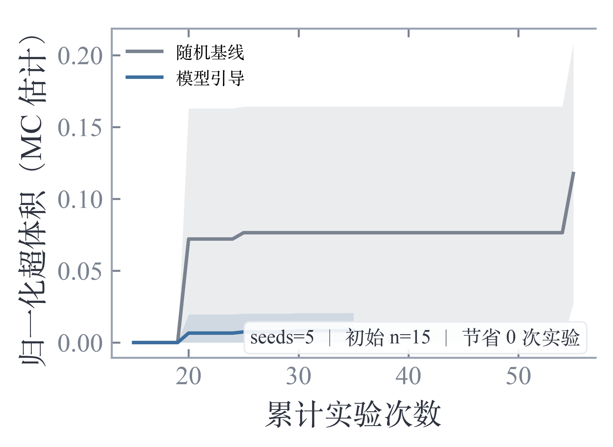

# L3 · 闭环效率基准对比报告（核心价值主证据）

- 生成时间：2026-09-26T07:47:15
- 目标规格：porosity_pct ≤ 3.96178 且 bond_strength_MPa ≥ 51.9249 且 coupled_damage_rate ≤ 0.851134
- 重放样本：280 行（三目标真实标签齐全）；其中满足规格 25 行（9%）
- 设置：初始 15 个样本，每轮补 5 个，5 个随机种子，κ=1.0，seed=42
- 校准因子应用：是（L1）

## 核心数字

- 模型引导：达标所需实验数中位数 **25**（各种子：[20, 30, 25, 35, 20]）
- 随机基线：达标所需实验数中位数 **25**（各种子：[50, 20, 25, 55, 20]）
- **节省 N = 0 次实验**

## 解释

本次重放中模型引导未跑赢随机基线（引导 25 次 vs 随机 25 次）。排查：① 初始样本是否太少（建议 ≥15 且覆盖主要参数区域）；② 目标规格是否过松（当前数据集达标点占比 9%，若 >40% 规格偏松，建议收紧到前 20% 水平重跑）；③ 悲观惩罚是否过强（κ=1.0，可试 1.5 加强置信）。

## 真实迭代收敛曲线

历史各模型版本的训练样本量：280 → 280 → 280 → 280 → 280 → 280 → 280 → 280 → 280 → 280 → 280 → 280 → 280 → 280 → 280 → 280 → 280 → 280 → 280 → 280 → 280 → 280 → 280 → 280 → 280 → 280 → 280 → 280 → 280 → 280 → 280 → 280 → 280 → 280 → 280 → 280 → 280

> 注：历史版本未保存训练数据快照，无法回算各版本超体积；
> 真实闭环超体积曲线建议自本版本起经「L2 验证任务单」闭环逐步积累。

> 真实标签全部取自数据集（重放模拟铁律：严禁以模型预测值冒充真值）；
> 超体积为蒙特卡洛估计（逐目标按规格盒归一化，跨量纲可比）。